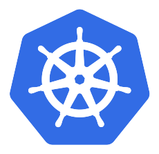

# Hi 👋 I'm Pavan Gudiwada 

- Senior Software Engineer (Developer Relations) at Freshworks
- Certified Kubernetes Application Developer (CKAD)
- FOSS Lover

### Skills
 
 

 

### Blogs
- [Four ways pods suddenly stop running on Kubernetes](https://home.robusta.dev/blog/oomkill-crashloops-evictions) - Robusta.dev
- [Best three tools for working with many Kubernetes contexts](https://home.robusta.dev/blog/switching-kubernets-context) - Robusta.dev
- [ Practical Kubernetes monitoring with Prometheus and Grafana](https://kubecampus.io/kubernetes/blog/practical-kubernetes-monitoring-with-prometheus-and-grafana/) - Kubecampus.io
- More blogs on [Hashnode](https://pavangudiwada.hashnode.dev/) & [Medium](https://pavangudiwada.medium.com/)

### Talks
- [Prometheus in 5 minutes - Pavan Gudiwada - Robusta.dev](https://www.youtube.com/watch?v=I6C09vPBpiA&list=PLfbj6mkGIOYtD_vaMI65tqzvHPRTcpBD_) - Kubernetes Community Days Pakistan
- [ Kubernetes-as-a-Service is better for you? ](https://www.youtube.com/watch?v=5i1TQEb7c90) - Ortelius Visionaries Summit 2022
<!-- - [Kubernetes monitoring done right with Robusta](https://www.youtube.com/watch?v=RP6bW-EevX0) - Kubesimplify CloudNative stories
- [Understand Terraform Cloud and Enterprise capabilities](https://www.youtube.com/watch?v=8JSTKHxkLTM) - Terraform HUG Sydney with Brad McCoy -->

### Wow!! can we talk? :exploding_head:
You + Me = Buddies :handshake:

 
   

  
<!--
**pavangudiwada/pavangudiwada** is a ✨ _special_ ✨ repository because its `README.md` (this file) appears on your GitHub profile.

Here are some ideas to get you started:

- 🔭 I’m currently working on ...
- 🌱 I’m currently learning ...
- 👯 I’m looking to collaborate on ...
- 🤔 I’m looking for help with ...
- 💬 Ask me about ...
- 📫 How to reach me: ...
- 😄 Pronouns: ...
- ⚡ Fun fact: ...

  
  
-->
